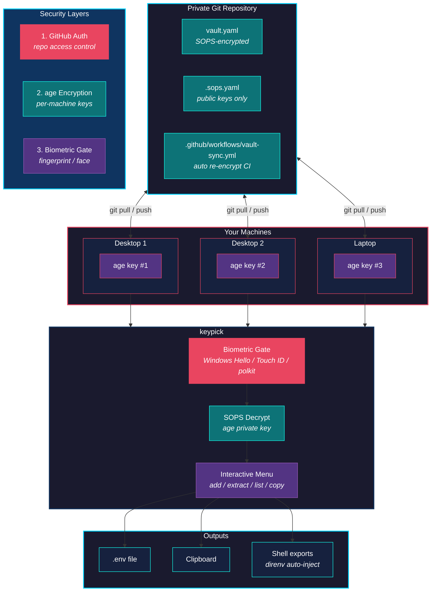

<p align="center">
  
</p>

<h1 align="center">KeyPick</h1>

<p align="center">
  <strong>A cross-platform, biometric-secured CLI for managing reusable API keys across multiple machines.</strong><br>
  Built on <strong>SOPS + age encryption</strong> with a <strong>private Git repo</strong> as the sync backbone.
</p>

<p align="center">
  <a href="#quick-start">Quick Start</a> &bull;
  <a href="TUTORIAL.md">Tutorial</a> &bull;
  <a href="#usage">Usage</a> &bull;
  <a href="#how-it-works">How It Works</a> &bull;
  <a href="#troubleshooting">Troubleshooting</a> &bull;
  <a href="#contributing">Contributing</a>
</p>

---

## Overview

New to KeyPick? Start with [TUTORIAL.md](TUTORIAL.md). It walks through installation, setup, multi-machine vaults, project workflows, `direnv`, recovery strategy, and advanced usage patterns.

KeyPick is a terminal-based secrets manager designed for developers who work across multiple machines. Instead of copying `.env` files around, texting yourself API keys, or storing them in plaintext notes, KeyPick gives you:

- **One encrypted vault** synced via a private Git repo
- **Biometric authentication** (Windows Hello, Touch ID, Linux polkit) before any secret is decrypted
- **Per-machine age keys** so compromising one machine doesn't compromise them all
- **A guided setup wizard** that installs prerequisites, generates keys, and configures everything for you
- **Shell integration** via direnv for automatic environment variable injection

```
keypick setup    # One-command setup wizard
keypick add      # Store secrets in encrypted groups
keypick extract  # Export to .env files
keypick copy     # Copy a single key to clipboard
keypick auto     # Non-interactive export for direnv/CI
keypick vault    # Manage vault selection
```

---

## Why KeyPick?

**The problem:** Every developer accumulates API keys, database credentials, and service tokens across projects. The common "solutions" are all terrible:

| Approach | Why It Fails |
|----------|-------------|
| `.env` files on each machine | Out of sync, easy to accidentally commit |
| Cloud password managers | Not designed for developer workflows, no CLI integration |
| Environment variables in shell profiles | Plaintext, no grouping, no sync |
| Shared team vaults (1Password, etc.) | Overkill for personal keys, subscription cost |
| Copy-pasting from Slack/email | Insecure, no audit trail, keys get lost |

**KeyPick's approach:** Encrypt everything with [age](https://github.com/FiloSottile/age), store it in a private Git repo you control, and gate decryption behind your fingerprint. Each machine gets its own encryption key. Syncing is just `git pull`.

---

## How It Works



**Three layers of security:**

1. **GitHub authentication** controls who can access the encrypted file
2. **age encryption** controls who can decrypt it (each machine has a unique private key)
3. **Biometric gate** (Windows Hello / Touch ID / polkit) protects every interactive decryption

Secrets are only ever unencrypted in memory during a `keypick` session. They are never written to disk in plaintext (except when you explicitly export a `.env` file).

---

## Tech Stack

| Component | Technology | Purpose |
|-----------|-----------|---------|
| **Language** | Rust | Performance, safety, cross-platform binaries |
| **Encryption** | [age](https://github.com/FiloSottile/age) | Modern, audited, no-config file encryption |
| **Secret management** | [SOPS](https://github.com/getsops/sops) | Encrypted file editing with multiple recipients |
| **Biometrics** | [robius-authentication](https://crates.io/crates/robius-authentication) | Windows Hello, Touch ID, Linux polkit |
| **CLI framework** | [clap](https://crates.io/crates/clap) | Argument parsing with derive macros |
| **Interactive prompts** | [inquire](https://crates.io/crates/inquire) | Select menus, text input, confirmations |
| **Progress indicators** | [indicatif](https://crates.io/crates/indicatif) | Download progress bars, operation spinners |
| **HTTP downloads** | [reqwest](https://crates.io/crates/reqwest) | Auto-download prerequisites from GitHub |
| **Sync backbone** | Git + GitHub | Encrypted vault synced across machines |
| **CI automation** | GitHub Actions | Auto re-encryption when recipients change |

---

## Quick Start

The fastest way to get running is the setup wizard. It handles everything.

### Automated Setup (Recommended)

```bash
# 1. Clone and build KeyPick
git clone https://github.com/YOUR_USERNAME/KeyPick.git
cd KeyPick
cargo build --release

# 2. Run the setup wizard
./target/release/keypick setup
```

The wizard will:
- Check for `age` and `sops`, downloading them automatically if missing
- Generate (or detect) your machine's age encryption key
- Ask whether this is your first machine or you're joining an existing vault
- Create or clone your encrypted vault repository under `~/.keypick/vaults/` by default
- Optionally configure GitHub Actions auto-sync and a recovery key

For a guided experience with detailed explanations of every step, use walkthrough mode:

```bash
./target/release/keypick setup --walkthrough
```

---

## Setup Walkthrough

This section mirrors what `keypick setup --walkthrough` shows in your terminal, explaining each step of the setup process so you understand what is happening and why.

### Phase 1: Prerequisites (age + sops)

**What are these tools?**

KeyPick doesn't implement its own cryptography. Instead, it uses two well-audited open-source tools:

| Tool | What It Does | Why KeyPick Needs It |
|------|-------------|---------------------|
| **[age](https://github.com/FiloSottile/age)** | Modern file encryption (like GPG, but simpler) | Each machine gets its own age keypair. The private key decrypts your vault; the public key lets others encrypt *for* this machine. |
| **[sops](https://github.com/getsops/sops)** | Encrypts individual values inside structured files (YAML/JSON) | Handles multi-recipient encryption so one vault can be decrypted by many machines. Key *names* stay visible; only *values* are encrypted. |

**What happens:** The wizard checks if `age` and `sops` are on your PATH. If either is missing, it downloads the correct binary for your OS and architecture from the official GitHub releases and places it in `~/.local/bin/` (or next to the `keypick` binary on Windows).

```
[1/4] Checking prerequisites...
  ✓ age already installed (v1.2.0)
  ✓ sops already installed (v3.9.4)
```

If they need to be downloaded, you'll see a progress bar for each.

---

### Phase 2: Machine Identity (age keypair)

**Why does each machine need its own key?**

This is a core security property. Each machine has a unique age keypair:
- **Private key** — stored locally at the platform-specific path below, never shared, never committed
- **Public key** — shared with your vault (listed in `.sops.yaml`) so secrets can be encrypted *for* this machine

If a machine is compromised, you revoke just that machine's key from `.sops.yaml` without affecting any others.

| Platform | Private key location |
|----------|---------------------|
| Windows | `%APPDATA%\sops\age\keys.txt` |
| macOS | `~/.config/sops/age/keys.txt` |
| Linux | `~/.config/sops/age/keys.txt` |

**What happens:** The wizard checks if an age key already exists. If so, you can reuse it (recommended) or generate a new one (the old one is backed up with a `.bak` extension). If no key exists, `age-keygen` generates a fresh keypair.

```
[2/4] Machine identity...
  ✓ Key generated: age1abc123def456...
    Saved to: C:\Users\you\AppData\Roaming\sops\age\keys.txt
```

> **Important:** Never share, commit, or copy your private key (`keys.txt`). If this machine is lost or compromised, remove its public key from `.sops.yaml` to revoke access.

---

### Phase 3: Vault Repository

**What is the vault?**

Your vault is a Git repository containing two key files:

| File | Contents | Safe to commit? |
|------|----------|----------------|
| `vault.yaml` | Your secrets, encrypted by sops+age | Yes (values are encrypted) |
| `.sops.yaml` | List of public keys that can decrypt the vault | Yes (public keys only) |

The repo should be **private** — even though values are encrypted, key *names* are visible in the YAML structure.

**What happens:** You choose one of two paths:

#### Path A: New vault (first machine)

Choose this if you've never used KeyPick before.

1. **Name your vault repo** (default: `my-keys`)
2. **Create the repo** — if GitHub CLI (`gh`) is installed and authenticated, KeyPick creates a private GitHub repo and clones it locally under `~/.keypick/vaults/`. Otherwise, it creates a local Git repo there.
3. **Create `.sops.yaml`** — this file tells sops which public keys can decrypt the vault. Initially, only this machine's key is listed:
   ```yaml
   creation_rules:
     - path_regex: vault\.yaml$
       age: >-
         age1your_public_key_here
   ```
4. **Create and encrypt `vault.yaml`** — an empty vault (`services: {}`) is created and encrypted in-place with `sops -e -i vault.yaml`
5. **Commit and push** — both files are committed to Git and pushed to the remote (if configured)

```
[3/4] Vault repository...
? Is this your first machine, or joining an existing vault? New vault (first machine)
? Vault repo name? my-keys
? Create a private GitHub repo automatically? Yes
  ✓ Created and cloned my-keys
  ✓ Created .sops.yaml
  ✓ Created and encrypted vault.yaml
  ✓ Initial commit created
  ✓ Pushed to remote
  Vault directory: C:\Users\you\.keypick\vaults\my-keys
```

#### Path B: Join existing vault (additional machine)

Choose this if you already set up KeyPick on another machine.

1. **Clone (or locate) your vault repo** — provide a GitHub `owner/repo` slug, a git clone URL, or a local path. New clones go into `~/.keypick/vaults/` by default.
2. **Verify `.sops.yaml` exists** — confirms this is a valid vault repo
3. **Check recipients** — shows all public keys currently in `.sops.yaml`
4. **Register this machine** — if your public key isn't already listed:
   - Adds your key to `.sops.yaml`
   - Runs `sops updatekeys -y vault.yaml` to re-encrypt the vault for all recipients (including this new machine)
   - Commits and pushes so other machines see the change

```
[3/4] Vault repository...
? Is this your first machine, or joining an existing vault? Join existing vault
? GitHub repo to clone? yourusername/my-keys
  ✓ Cloned yourusername/my-keys

  Current recipients:
    - age1abc123def456ghi789...
  ✓ Added key age1xyz987wvu654... to recipients
  ✓ Vault re-encrypted
  ✓ Changes committed
  ✓ Pushed to remote
  Vault directory: C:\Users\you\.keypick\vaults\my-keys
```

---

### Phase 4: Optional Enhancements

After the core setup, the wizard offers two optional features:

#### GitHub Actions Auto-Sync

**The problem it solves:** When you add a new machine, you update `.sops.yaml` with its public key. But `vault.yaml` is still encrypted for the *old* set of recipients — the new machine can't decrypt it until someone with existing access runs `sops updatekeys`.

**The solution:** A GitHub Actions workflow watches for changes to `.sops.yaml`. When it detects a change, it automatically:
1. Downloads age and sops
2. Imports a dedicated CI age key from GitHub Secrets
3. Runs `sops updatekeys -y vault.yaml` to re-encrypt for all current recipients
4. Commits and pushes the re-encrypted vault

**Setup steps:**
1. **Generate a CI age keypair** — separate from your machine keys, used only by GitHub Actions
2. **Add the CI public key to `.sops.yaml`** — so the workflow can decrypt during re-encryption
3. **Store the CI private key as a GitHub Secret** (`SOPS_AGE_KEY`) — piped to `gh secret set`, encrypted by GitHub with libsodium
4. **Install the workflow file** — `.github/workflows/vault-sync.yml` is created in your repo
5. **Commit and push** — activates the workflow

```
? Set up GitHub Actions auto-sync? Yes
  ✓ Generated Actions key: age1actionskey123...
  ✓ Added Actions key to .sops.yaml
  ✓ Set SOPS_AGE_KEY secret on GitHub
  ✓ Installed .github/workflows/vault-sync.yml
  ✓ Pushed to remote
```

#### Recovery Key

**The problem it solves:** If you lose access to *all* your machines (laptop stolen, desktop dies), you lose access to your vault forever. A recovery key is your safety net.

**How it works:**
1. **Generate a recovery age keypair** — not tied to any machine
2. **You choose a strong passphrase** — this protects the recovery key itself
3. **Encrypt the private key with your passphrase** — saved as `recovery_key.age`
4. **Add the recovery public key to `.sops.yaml`** — so the recovery key can decrypt the vault
5. **Re-encrypt the vault** — includes the recovery key as a recipient

**Storage rules (two-factor recovery):**

| What | Where | Why |
|------|-------|-----|
| `recovery_key.age` (encrypted file) | Cloud storage (Google Drive, iCloud, Dropbox) | Accessible from anywhere, but useless without the passphrase |
| Passphrase | Paper in a safe or lockbox | Physical security, but useless without the file |

Store the file and passphrase in **separate physical locations**. An attacker would need to compromise *both* to access your secrets.

**To use the recovery key later:**
```bash
# 1. Download recovery_key.age from cloud storage
# 2. Decrypt it with your passphrase
age -d recovery_key.age > temp_key.txt

# 3. Use it to access your vault
SOPS_AGE_KEY_FILE=temp_key.txt keypick list

# 4. Delete the temporary plaintext key immediately
rm temp_key.txt
```

```
? Create a recovery key? Yes
  ✓ Generated recovery key: age1recoverykey123...
? Enter a strong passphrase for the recovery key: ********
? Confirm passphrase: ********
  ✓ Encrypted recovery key saved to recovery_key.age
  ✓ Added recovery key to .sops.yaml recipients
  ✓ Vault re-encrypted with recovery key
  ✓ Changes committed and pushed
```

---

### After Setup

Once setup completes, you're ready to use KeyPick:

```bash
# Store your first secrets
keypick add

# Inspect or change the active vault
keypick vault list
keypick vault current
keypick vault select

# In a project directory, export secrets to .env
cd ~/projects/my-app
keypick extract

# On another machine, join the vault
keypick setup   # Choose "Join existing vault"
```

Your secrets are encrypted at rest and protected by biometric authentication. They are only ever decrypted in memory during a `keypick` session.

---

## Installation

KeyPick ships two interchangeable implementations with identical CLI and feature parity:

- **Rust** — a single ~5 MB native binary, no runtime required.
- **TypeScript** — runs on [Bun](https://bun.sh), easier to hack on.

Pick whichever fits your machine. The one-line installer prompts you for a choice.

### One-line installer (recommended)

**macOS / Linux:**

```bash
curl -fsSL https://raw.githubusercontent.com/seanrobertwright/KeyPick/master/install.sh | sh
```

**Windows (PowerShell):**

```powershell
irm https://raw.githubusercontent.com/seanrobertwright/KeyPick/master/install.ps1 | iex
```

### Direct install (TypeScript)

If you already have Bun installed:

```bash
bun install -g keypick
```

### Direct install (Rust)

Prebuilt binaries for each platform are attached to every GitHub release. Download the archive matching your OS/arch from the [Releases page](https://github.com/seanrobertwright/KeyPick/releases), extract it, and put `keypick` on your `PATH`.

Or build from source:

```bash
git clone https://github.com/seanrobertwright/KeyPick.git
cd KeyPick/rust
cargo build --release
# Binary is at rust/target/release/keypick(.exe)
```

### WSL (Windows Subsystem for Linux)

Both implementations run in WSL. WSL looks like Linux to the process, but:

- **Biometric auth** routes through Windows Hello on the host via `powershell.exe` (exposed by WSL interop). You get the same fingerprint/PIN prompt as native Windows — no polkit required.
- **`age` and `sops`** install as Linux binaries inside WSL. Your age keypair lives at `~/.config/sops/age/keys.txt` in the WSL distro, *not* the Windows host. Machines sharing the same vault still need distinct keys.
- **Clipboard** works through WSL interop (`clip.exe` for the TS build; the Rust build may need WSLg or `xclip` depending on your WSL distro).

Install via the Linux one-liner from inside your WSL shell:

```bash
curl -fsSL https://raw.githubusercontent.com/seanrobertwright/KeyPick/master/install.sh | sh
```

### Prerequisites

Both implementations need **Git** for vault syncing. The first-run `keypick setup` wizard installs `age` and `sops` automatically; if you'd rather do it by hand:

| Tool | Windows | macOS | Linux |
|------|---------|-------|-------|
| **age** | [Download .zip](https://github.com/FiloSottile/age/releases) | `brew install age` | `apt install age` |
| **sops** | [Download .exe](https://github.com/getsops/sops/releases) | `brew install sops` | `apt install sops` |

The Rust build also needs `build-essential`, `pkg-config`, and `libdbus-1-dev` on Debian/Ubuntu if you're compiling from source.

---

## Usage

### First-Time Setup

```bash
keypick setup
```

The interactive wizard walks you through everything. On your first machine it will:
1. Install `age` and `sops` (if missing)
2. Generate your machine's age encryption key
3. Create a private vault repository under `~/.keypick/vaults/`
4. Optionally set up GitHub Actions and a recovery key

On additional machines, choose "Join existing vault" to clone your repo and register the new machine's key.

### Setup Subcommands

```bash
keypick setup                    # Full wizard
keypick setup --walkthrough      # Full wizard with step-by-step explanations
keypick setup actions            # Just the GitHub Actions configuration
keypick setup recovery           # Just the recovery key generation
```

### Vault Commands

```bash
keypick vault list      # Show known vault repositories
keypick vault current   # Print the active vault repository
keypick vault select    # Interactively choose the active vault repository
```

KeyPick resolves a vault in this order:
1. `KEYPICK_VAULT_DIR`
2. The current directory if you are already inside a vault repo
3. The remembered active vault
4. Vaults under `~/.keypick/vaults/`
5. An interactive selector if multiple candidates are available

If your machine blocks writes to `~/.keypick`, set `KEYPICK_HOME` to a writable directory. On Windows, a good default is:

```powershell
setx KEYPICK_HOME "$env:USERPROFILE\OneDrive\Documents\KeyPick"
```

Then open a new shell and run:

```powershell
keypick vault select
keypick vault current
```

---

### Interactive Menu

```bash
keypick
```

When run without arguments, KeyPick shows a menu after biometric verification:

```
? What would you like to do?
> Extract keys to .env
  Add / Update a key group
  List vault contents
  Copy a key to clipboard
  Exit
```

---

### Add Secrets

```bash
keypick add
```

Secrets are organized into **groups** (e.g., `Supabase_Prod`, `Google_AI`, `Stripe_Test`).

**Example session:**
```
? Select a group:
> [ + New Group ]
  Supabase_Prod
  Google_AI

? Service/Group name: Stripe_Test

  Adding keys to group: Stripe_Test

? Key Name: STRIPE_SECRET_KEY
? Value for STRIPE_SECRET_KEY: sk_test_xxxxxxxxxxxxx
  + Added: STRIPE_SECRET_KEY

? Add another key to this group? Yes

? Key Name: STRIPE_PUBLISHABLE_KEY
? Value for STRIPE_PUBLISHABLE_KEY: pk_test_xxxxxxxxxxxxx
  + Added: STRIPE_PUBLISHABLE_KEY

? Add another key to this group? No

  Vault updated successfully.
  Remember to sync: cd ~/.keypick/vaults/my-keys && git add vault.yaml && git commit -m "Add Stripe_Test" && git push
```

---

### Extract to .env File

```bash
cd my-project
keypick extract
```

Select one or more groups to export:

```
? Select the groups to extract (Space to toggle, Enter to confirm):
> [x] Supabase_Prod
  [x] Stripe_Test
  [ ] Google_AI

  5 keys from 2 group(s) written to .env
  WARNING: Add .env to your .gitignore so secrets are never committed.
```

The generated `.env`:
```env
# --- Supabase_Prod ---
DB_HOST=db.xxxxx.supabase.co
DB_PASSWORD=secret_value
SUPABASE_SECRET=service_role_key_abc

# --- Stripe_Test ---
STRIPE_SECRET_KEY=sk_test_xxxxxxxxxxxxx
STRIPE_PUBLISHABLE_KEY=pk_test_xxxxxxxxxxxxx
```

---

### List Vault Contents

```bash
keypick list
```

Shows all groups and key names with values hidden:

```
Vault Contents (values hidden):

  Google_AI
    - API_KEY
    - PROJECT_ID

  Stripe_Test
    - STRIPE_PUBLISHABLE_KEY
    - STRIPE_SECRET_KEY

  Supabase_Prod
    - DB_HOST
    - DB_PASSWORD
    - SUPABASE_SECRET

  3 group(s), 7 key(s) total.
```

---

### Copy to Clipboard

```bash
keypick copy
```

Select a group, then a key. The value is copied to your clipboard without ever being written to disk.

```
? Select a group: Supabase_Prod
? Select a key: DB_PASSWORD

  Copied DB_PASSWORD to clipboard.
```

---

### Automatic Shell Injection (direnv)

```bash
keypick auto Supabase_Prod Google_AI
```

Outputs `export KEY='VALUE'` statements to stdout. Designed for use with [direnv](https://direnv.net/):

**Create a `.envrc` in your project:**
```bash
# my-project/.envrc
eval $(keypick auto Supabase_Prod Google_AI)
```

**Allow it once:**
```bash
direnv allow
```

Now every time you `cd` into the project, your keys are automatically loaded as environment variables. When you `cd` out, they're removed.

> **Note:** `keypick auto` skips the biometric gate for non-interactive use. Your secrets are still protected by Git authentication and age encryption at rest.

**direnv installation:**
```bash
# Windows
winget install direnv.direnv

# macOS
brew install direnv

# Linux
apt install direnv
```

Add the hook to your shell profile:
```bash
# bash (~/.bashrc)
eval "$(direnv hook bash)"

# zsh (~/.zshrc)
eval "$(direnv hook zsh)"

# PowerShell ($PROFILE)
Invoke-Expression "$(direnv hook pwsh)"
```

---

### Syncing Between Machines

```bash
# Pull latest keys on any machine
cd ~/.keypick/vaults/my-keys
git pull

# After adding or updating keys, push
git add vault.yaml
git commit -m "Add Stripe_Test keys"
git push
```

Adding a new machine is straightforward:
1. Run `keypick setup` and choose "Join existing vault"
2. The wizard clones your repo, registers the machine's key, and pushes

If you've set up GitHub Actions, the vault is automatically re-encrypted for the new recipient.

---

### Recovery Key

If you lose access to all your machines, a recovery key lets you restore access.

**Create one during setup** (or run later):
```bash
keypick setup recovery
```

The wizard:
1. Generates a recovery keypair
2. Encrypts it with a passphrase you choose
3. Adds the recovery public key to your vault recipients
4. Saves `recovery_key.age` for you to upload to cloud storage

**Storage rules:**
| What | Where |
|------|-------|
| `recovery_key.age` (encrypted file) | Google Drive, iCloud, etc. |
| Passphrase | Written on paper, in a safe/lockbox |

Store the file and passphrase in **separate physical locations**. Both are required to recover.

**Using the recovery key:**
```bash
# Decrypt the recovery key
age -d recovery_key.age > temp_key.txt

# Use it to access the vault
SOPS_AGE_KEY_FILE=temp_key.txt keypick list

# Delete the temp key immediately after
rm temp_key.txt
```

---

## Command Reference

| Command | Description |
|---------|-------------|
| `keypick` | Interactive menu (biometric required) |
| `keypick add` | Add or update keys in a group |
| `keypick extract` | Export groups to a `.env` file |
| `keypick list` | List all groups and key names (values hidden) |
| `keypick copy` | Copy a single key to clipboard |
| `keypick auto <groups...>` | Non-interactive export for direnv/shell eval |
| `keypick vault list` | Show known vault repositories |
| `keypick vault current` | Print the active vault repository |
| `keypick vault select` | Interactively choose the active vault repository |
| `keypick setup` | Full setup wizard |
| `keypick setup --walkthrough` | Setup wizard with detailed explanations of each step |
| `keypick setup actions` | Configure GitHub Actions auto-sync |
| `keypick setup actions --walkthrough` | Actions setup with detailed explanations |
| `keypick setup recovery` | Generate a recovery key |
| `keypick setup recovery --walkthrough` | Recovery key setup with detailed explanations |

---

## Project Structure

```
KeyPick/
├── Cargo.toml
├── .sops.yaml                          # Template for secrets repos
├── .github/
│   └── workflows/
│       └── vault-sync.yml              # Template: auto re-encryption CI
└── src/
    ├── main.rs                         # Entry point, CLI routing
    ├── auth.rs                         # Biometric authentication
    ├── vault.rs                        # SOPS encrypt/decrypt, data model
    └── commands/
        ├── mod.rs
        ├── add.rs                      # keypick add
        ├── extract.rs                  # keypick extract
        ├── list.rs                     # keypick list
        ├── copy.rs                     # keypick copy
        ├── auto_export.rs              # keypick auto
        ├── interactive.rs              # No-argument menu mode
        ├── vaults.rs                   # keypick vault
        └── setup/
            ├── mod.rs                  # Setup wizard orchestrator
            ├── utils.rs                # Shared helpers (spinners, downloads, platform)
            ├── prerequisites.rs        # age/sops auto-installer
            ├── keygen.rs               # Age key generation
            ├── init.rs                 # First machine flow
            ├── join.rs                 # Additional machine flow
            ├── actions.rs              # GitHub Actions wizard
            └── recovery.rs             # Recovery key wizard
```

---

## Troubleshooting

### `sops` or `age` not found after setup

The setup wizard installs binaries to `~/.local/bin/` or next to `keypick.exe`. If your shell can't find them:

```bash
# Check where they were installed
which age sops          # macOS/Linux
where age sops          # Windows

# Add to PATH if needed (bash/zsh)
export PATH="$HOME/.local/bin:$PATH"

# Add to PATH (PowerShell - add to $PROFILE for persistence)
$env:PATH += ";$env:USERPROFILE\.local\bin"
```

### SOPS decryption failed

```
SOPS decryption failed: ...
```

This means your machine's age private key can't decrypt the vault. Common causes:

- **Wrong vault selected:** Run `keypick vault current` and `keypick vault list`, or set `KEYPICK_VAULT_DIR` explicitly
- **KeyPick state directory is not writable:** Set `KEYPICK_HOME` to a writable location, then re-run `keypick vault select`
- **Missing key file:** Verify your age key exists:
  ```bash
  # Windows
  cat "$env:APPDATA\sops\age\keys.txt"

  # macOS/Linux
  cat ~/.config/sops/age/keys.txt
  ```
- **Machine not registered:** Your public key might not be in `.sops.yaml`. Run `keypick setup` and choose "Join existing vault"

### Authentication failed

```
Authentication failed: ...
```

The biometric prompt was cancelled or failed. Possible causes:

- **Windows Hello not configured:** Set up a PIN/fingerprint in Settings > Accounts > Sign-in options
- **Touch ID not enabled:** Enable in System Preferences > Touch ID
- **Linux polkit missing:** Install `policykit-1` or your distro's equivalent
- **Remote/SSH session:** Biometrics require a local display. Use `keypick auto` for non-interactive access

### GitHub Actions workflow not triggering

- Verify the `SOPS_AGE_KEY` secret is set in your repo's Settings > Secrets > Actions
- Check that `.github/workflows/vault-sync.yml` exists in your secrets repo
- The workflow only triggers on pushes to `.sops.yaml` or `vault.yaml`
- Run `keypick setup actions` to reconfigure

### `gh` CLI not authenticated

If the setup wizard can't create repos or set secrets:

```bash
gh auth login
gh auth status  # Verify
```

### Vault shows as empty after cloning on a new machine

You need to register this machine's key first. The vault is encrypted for specific recipients:

```bash
keypick setup  # Choose "Join existing vault"
```

### Multiple vaults are available

```bash
keypick vault list
keypick vault select
```

Or override a single command explicitly:

```bash
KEYPICK_VAULT_DIR=/path/to/vault keypick list
```

If KeyPick cannot save the selected vault because its state directory is not writable, set `KEYPICK_HOME` first:

```powershell
setx KEYPICK_HOME "$env:USERPROFILE\OneDrive\Documents\KeyPick"
```

---

## Security Model

| Layer | Protection |
|-------|-----------|
| **Git repo (private)** | Controls who can access the encrypted file |
| **age encryption** | Each machine has a unique keypair; only authorized machines can decrypt |
| **Biometric gate** | Windows Hello / Touch ID required before any decryption |
| **SOPS** | Manages multi-recipient encryption; individual values encrypted in YAML |
| **GitHub Actions key** | Separate keypair for CI, stored only in GitHub Secrets |
| **Recovery key** | Passphrase-protected, stored offline in separate physical locations |

**What is safe to commit:** `vault.yaml` (encrypted), `.sops.yaml` (public keys only), workflow files.

**What must never be committed:** `.env` files, `keys.txt`, `recovery_key.age` plaintext, any file containing private keys.

---

## Contributing

Contributions are welcome! Here's how to get started:

### Development Setup

```bash
git clone https://github.com/YOUR_USERNAME/KeyPick.git
cd KeyPick
cargo build
cargo check  # Fast compilation check
```

### Guidelines

1. **Fork the repo** and create your branch from `master`
2. **Write clear commit messages** following [Conventional Commits](https://www.conventionalcommits.org/) (e.g., `feat:`, `fix:`, `docs:`)
3. **Test your changes** — make sure `cargo build --release` succeeds with zero warnings
4. **Keep it simple** — KeyPick values simplicity over feature count
5. **Security first** — never log, print, or write secrets to disk unless the user explicitly requests it

### Submitting Changes

1. Fork the repository
2. Create a feature branch: `git checkout -b feature/my-feature`
3. Make your changes and commit them
4. Push to your fork: `git push origin feature/my-feature`
5. Open a Pull Request with a clear description of what and why

### Reporting Issues

- Use [GitHub Issues](https://github.com/YOUR_USERNAME/KeyPick/issues) to report bugs or request features
- Include your OS, Rust version (`rustc --version`), and steps to reproduce

---

## License

This project is licensed under the MIT License. See [LICENSE](LICENSE) for details.
