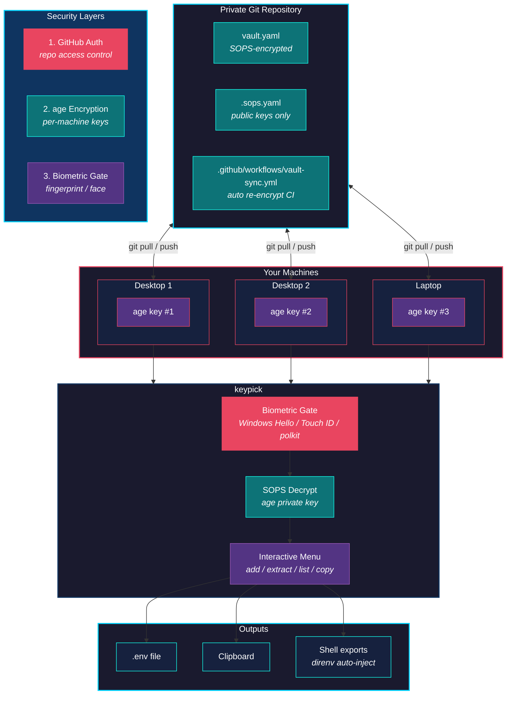

<p align="center">
  
</p>

<h1 align="center">KeyPick</h1>

<p align="center">
  <strong>A cross-platform, biometric-secured CLI for managing reusable API keys across multiple machines.</strong><br>
  Built on <strong>SOPS + age encryption</strong> with a <strong>private Git repo</strong> as the sync backbone.
</p>

<p align="center">
  <a href="#quick-start">Quick Start</a> &bull;
  <a href="#usage">Usage</a> &bull;
  <a href="#how-it-works">How It Works</a> &bull;
  <a href="#troubleshooting">Troubleshooting</a> &bull;
  <a href="#contributing">Contributing</a>
</p>

---

## Overview

KeyPick is a terminal-based secrets manager designed for developers who work across multiple machines. Instead of copying `.env` files around, texting yourself API keys, or storing them in plaintext notes, KeyPick gives you:

- **One encrypted vault** synced via a private Git repo
- **Biometric authentication** (Windows Hello, Touch ID, Linux polkit) before any secret is decrypted
- **Per-machine age keys** so compromising one machine doesn't compromise them all
- **A guided setup wizard** that installs prerequisites, generates keys, and configures everything for you
- **Shell integration** via direnv for automatic environment variable injection

```
keypick setup    # One-command setup wizard
keypick add      # Store secrets in encrypted groups
keypick extract  # Export to .env files
keypick copy     # Copy a single key to clipboard
keypick auto     # Non-interactive export for direnv/CI
```

---

## Why KeyPick?

**The problem:** Every developer accumulates API keys, database credentials, and service tokens across projects. The common "solutions" are all terrible:

| Approach | Why It Fails |
|----------|-------------|
| `.env` files on each machine | Out of sync, easy to accidentally commit |
| Cloud password managers | Not designed for developer workflows, no CLI integration |
| Environment variables in shell profiles | Plaintext, no grouping, no sync |
| Shared team vaults (1Password, etc.) | Overkill for personal keys, subscription cost |
| Copy-pasting from Slack/email | Insecure, no audit trail, keys get lost |

**KeyPick's approach:** Encrypt everything with [age](https://github.com/FiloSottile/age), store it in a private Git repo you control, and gate decryption behind your fingerprint. Each machine gets its own encryption key. Syncing is just `git pull`.

---

## How It Works



**Three layers of security:**

1. **GitHub authentication** controls who can access the encrypted file
2. **age encryption** controls who can decrypt it (each machine has a unique private key)
3. **Biometric gate** (Windows Hello / Touch ID / polkit) protects every interactive decryption

Secrets are only ever unencrypted in memory during a `keypick` session. They are never written to disk in plaintext (except when you explicitly export a `.env` file).

---

## Tech Stack

| Component | Technology | Purpose |
|-----------|-----------|---------|
| **Language** | Rust | Performance, safety, cross-platform binaries |
| **Encryption** | [age](https://github.com/FiloSottile/age) | Modern, audited, no-config file encryption |
| **Secret management** | [SOPS](https://github.com/getsops/sops) | Encrypted file editing with multiple recipients |
| **Biometrics** | [robius-authentication](https://crates.io/crates/robius-authentication) | Windows Hello, Touch ID, Linux polkit |
| **CLI framework** | [clap](https://crates.io/crates/clap) | Argument parsing with derive macros |
| **Interactive prompts** | [inquire](https://crates.io/crates/inquire) | Select menus, text input, confirmations |
| **Progress indicators** | [indicatif](https://crates.io/crates/indicatif) | Download progress bars, operation spinners |
| **HTTP downloads** | [reqwest](https://crates.io/crates/reqwest) | Auto-download prerequisites from GitHub |
| **Sync backbone** | Git + GitHub | Encrypted vault synced across machines |
| **CI automation** | GitHub Actions | Auto re-encryption when recipients change |

---

## Quick Start

The fastest way to get running is the setup wizard. It handles everything.

### Automated Setup (Recommended)

```bash
# 1. Clone and build KeyPick
git clone https://github.com/YOUR_USERNAME/KeyPick.git
cd KeyPick
cargo build --release

# 2. Run the setup wizard
./target/release/keypick setup
```

The wizard will:
- Check for `age` and `sops`, downloading them automatically if missing
- Generate (or detect) your machine's age encryption key
- Ask whether this is your first machine or you're joining an existing vault
- Create or clone your encrypted vault repository
- Optionally configure GitHub Actions auto-sync and a recovery key

---

## Installation

### Prerequisites

You need **Rust** (for building) and **Git** (for syncing). The setup wizard handles `age` and `sops` for you, but you can also install them manually.

### Windows

```powershell
# Install Rust (if not already installed)
winget install Rustlang.Rustup

# Clone and build
git clone https://github.com/YOUR_USERNAME/KeyPick.git
cd KeyPick
cargo build --release

# Add to PATH (choose one):
# Option A: Copy to a directory already on PATH
Copy-Item .\target\release\keypick.exe "$env:USERPROFILE\.local\bin\"

# Option B: Copy next to other system tools
Copy-Item .\target\release\keypick.exe C:\Windows\System32\

# Verify
keypick --version
```

### macOS

```bash
# Install Rust (if not already installed)
curl --proto '=https' --tlsv1.2 -sSf https://sh.rustup.rs | sh

# Clone and build
git clone https://github.com/YOUR_USERNAME/KeyPick.git
cd KeyPick
cargo build --release

# Add to PATH
cp target/release/keypick ~/.local/bin/
# or
sudo cp target/release/keypick /usr/local/bin/

# Verify
keypick --version
```

### Linux

```bash
# Install Rust (if not already installed)
curl --proto '=https' --tlsv1.2 -sSf https://sh.rustup.rs | sh

# Install build dependencies (Debian/Ubuntu)
sudo apt install -y build-essential pkg-config libdbus-1-dev

# Clone and build
git clone https://github.com/YOUR_USERNAME/KeyPick.git
cd KeyPick
cargo build --release

# Add to PATH
cp target/release/keypick ~/.local/bin/

# Verify
keypick --version
```

### Manual Prerequisite Installation

If you prefer to install `age` and `sops` manually instead of letting the wizard do it:

| Tool | Windows | macOS | Linux |
|------|---------|-------|-------|
| **age** | [Download .zip](https://github.com/FiloSottile/age/releases) | `brew install age` | `apt install age` |
| **sops** | [Download .exe](https://github.com/getsops/sops/releases) | `brew install sops` | `apt install sops` |

---

## Usage

### First-Time Setup

```bash
keypick setup
```

The interactive wizard walks you through everything. On your first machine it will:
1. Install `age` and `sops` (if missing)
2. Generate your machine's age encryption key
3. Create a private vault repository
4. Optionally set up GitHub Actions and a recovery key

On additional machines, choose "Join existing vault" to clone your repo and register the new machine's key.

### Setup Subcommands

```bash
keypick setup           # Full wizard
keypick setup actions   # Just the GitHub Actions configuration
keypick setup recovery  # Just the recovery key generation
```

---

### Interactive Menu

```bash
keypick
```

When run without arguments, KeyPick shows a menu after biometric verification:

```
? What would you like to do?
> Extract keys to .env
  Add / Update a key group
  List vault contents
  Copy a key to clipboard
  Exit
```

---

### Add Secrets

```bash
keypick add
```

Secrets are organized into **groups** (e.g., `Supabase_Prod`, `Google_AI`, `Stripe_Test`).

**Example session:**
```
? Select a group:
> [ + New Group ]
  Supabase_Prod
  Google_AI

? Service/Group name: Stripe_Test

  Adding keys to group: Stripe_Test

? Key Name: STRIPE_SECRET_KEY
? Value for STRIPE_SECRET_KEY: sk_test_xxxxxxxxxxxxx
  + Added: STRIPE_SECRET_KEY

? Add another key to this group? Yes

? Key Name: STRIPE_PUBLISHABLE_KEY
? Value for STRIPE_PUBLISHABLE_KEY: pk_test_xxxxxxxxxxxxx
  + Added: STRIPE_PUBLISHABLE_KEY

? Add another key to this group? No

  Vault updated successfully.
  Remember to sync: git add vault.yaml && git commit -m "Add Stripe_Test" && git push
```

---

### Extract to .env File

```bash
cd my-project
keypick extract
```

Select one or more groups to export:

```
? Select the groups to extract (Space to toggle, Enter to confirm):
> [x] Supabase_Prod
  [x] Stripe_Test
  [ ] Google_AI

  5 keys from 2 group(s) written to .env
  WARNING: Add .env to your .gitignore so secrets are never committed.
```

The generated `.env`:
```env
# --- Supabase_Prod ---
DB_HOST=db.xxxxx.supabase.co
DB_PASSWORD=secret_value
SUPABASE_SECRET=service_role_key_abc

# --- Stripe_Test ---
STRIPE_SECRET_KEY=sk_test_xxxxxxxxxxxxx
STRIPE_PUBLISHABLE_KEY=pk_test_xxxxxxxxxxxxx
```

---

### List Vault Contents

```bash
keypick list
```

Shows all groups and key names with values hidden:

```
Vault Contents (values hidden):

  Google_AI
    - API_KEY
    - PROJECT_ID

  Stripe_Test
    - STRIPE_PUBLISHABLE_KEY
    - STRIPE_SECRET_KEY

  Supabase_Prod
    - DB_HOST
    - DB_PASSWORD
    - SUPABASE_SECRET

  3 group(s), 7 key(s) total.
```

---

### Copy to Clipboard

```bash
keypick copy
```

Select a group, then a key. The value is copied to your clipboard without ever being written to disk.

```
? Select a group: Supabase_Prod
? Select a key: DB_PASSWORD

  Copied DB_PASSWORD to clipboard.
```

---

### Automatic Shell Injection (direnv)

```bash
keypick auto Supabase_Prod Google_AI
```

Outputs `export KEY='VALUE'` statements to stdout. Designed for use with [direnv](https://direnv.net/):

**Create a `.envrc` in your project:**
```bash
# my-project/.envrc
eval $(keypick auto Supabase_Prod Google_AI)
```

**Allow it once:**
```bash
direnv allow
```

Now every time you `cd` into the project, your keys are automatically loaded as environment variables. When you `cd` out, they're removed.

> **Note:** `keypick auto` skips the biometric gate for non-interactive use. Your secrets are still protected by Git authentication and age encryption at rest.

**direnv installation:**
```bash
# Windows
winget install direnv.direnv

# macOS
brew install direnv

# Linux
apt install direnv
```

Add the hook to your shell profile:
```bash
# bash (~/.bashrc)
eval "$(direnv hook bash)"

# zsh (~/.zshrc)
eval "$(direnv hook zsh)"

# PowerShell ($PROFILE)
Invoke-Expression "$(direnv hook pwsh)"
```

---

### Syncing Between Machines

```bash
# Pull latest keys on any machine
cd my-keys
git pull

# After adding or updating keys, push
git add vault.yaml
git commit -m "Add Stripe_Test keys"
git push
```

Adding a new machine is straightforward:
1. Run `keypick setup` and choose "Join existing vault"
2. The wizard clones your repo, registers the machine's key, and pushes

If you've set up GitHub Actions, the vault is automatically re-encrypted for the new recipient.

---

### Recovery Key

If you lose access to all your machines, a recovery key lets you restore access.

**Create one during setup** (or run later):
```bash
keypick setup recovery
```

The wizard:
1. Generates a recovery keypair
2. Encrypts it with a passphrase you choose
3. Adds the recovery public key to your vault recipients
4. Saves `recovery_key.age` for you to upload to cloud storage

**Storage rules:**
| What | Where |
|------|-------|
| `recovery_key.age` (encrypted file) | Google Drive, iCloud, etc. |
| Passphrase | Written on paper, in a safe/lockbox |

Store the file and passphrase in **separate physical locations**. Both are required to recover.

**Using the recovery key:**
```bash
# Decrypt the recovery key
age -d recovery_key.age > temp_key.txt

# Use it to access the vault
SOPS_AGE_KEY_FILE=temp_key.txt keypick list

# Delete the temp key immediately after
rm temp_key.txt
```

---

## Command Reference

| Command | Description |
|---------|-------------|
| `keypick` | Interactive menu (biometric required) |
| `keypick add` | Add or update keys in a group |
| `keypick extract` | Export groups to a `.env` file |
| `keypick list` | List all groups and key names (values hidden) |
| `keypick copy` | Copy a single key to clipboard |
| `keypick auto <groups...>` | Non-interactive export for direnv/shell eval |
| `keypick setup` | Full setup wizard |
| `keypick setup actions` | Configure GitHub Actions auto-sync |
| `keypick setup recovery` | Generate a recovery key |

---

## Project Structure

```
KeyPick/
├── Cargo.toml
├── .sops.yaml                          # Template for secrets repos
├── .github/
│   └── workflows/
│       └── vault-sync.yml              # Template: auto re-encryption CI
└── src/
    ├── main.rs                         # Entry point, CLI routing
    ├── auth.rs                         # Biometric authentication
    ├── vault.rs                        # SOPS encrypt/decrypt, data model
    └── commands/
        ├── mod.rs
        ├── add.rs                      # keypick add
        ├── extract.rs                  # keypick extract
        ├── list.rs                     # keypick list
        ├── copy.rs                     # keypick copy
        ├── auto_export.rs              # keypick auto
        ├── interactive.rs              # No-argument menu mode
        └── setup/
            ├── mod.rs                  # Setup wizard orchestrator
            ├── utils.rs                # Shared helpers (spinners, downloads, platform)
            ├── prerequisites.rs        # age/sops auto-installer
            ├── keygen.rs               # Age key generation
            ├── init.rs                 # First machine flow
            ├── join.rs                 # Additional machine flow
            ├── actions.rs              # GitHub Actions wizard
            └── recovery.rs             # Recovery key wizard
```

---

## Troubleshooting

### `sops` or `age` not found after setup

The setup wizard installs binaries to `~/.local/bin/` or next to `keypick.exe`. If your shell can't find them:

```bash
# Check where they were installed
which age sops          # macOS/Linux
where age sops          # Windows

# Add to PATH if needed (bash/zsh)
export PATH="$HOME/.local/bin:$PATH"

# Add to PATH (PowerShell - add to $PROFILE for persistence)
$env:PATH += ";$env:USERPROFILE\.local\bin"
```

### SOPS decryption failed

```
SOPS decryption failed: ...
```

This means your machine's age private key can't decrypt the vault. Common causes:

- **Wrong directory:** Make sure you're running `keypick` from inside your vault repo (where `vault.yaml` lives)
- **Missing key file:** Verify your age key exists:
  ```bash
  # Windows
  cat "$env:APPDATA\sops\age\keys.txt"

  # macOS/Linux
  cat ~/.config/sops/age/keys.txt
  ```
- **Machine not registered:** Your public key might not be in `.sops.yaml`. Run `keypick setup` and choose "Join existing vault"

### Authentication failed

```
Authentication failed: ...
```

The biometric prompt was cancelled or failed. Possible causes:

- **Windows Hello not configured:** Set up a PIN/fingerprint in Settings > Accounts > Sign-in options
- **Touch ID not enabled:** Enable in System Preferences > Touch ID
- **Linux polkit missing:** Install `policykit-1` or your distro's equivalent
- **Remote/SSH session:** Biometrics require a local display. Use `keypick auto` for non-interactive access

### GitHub Actions workflow not triggering

- Verify the `SOPS_AGE_KEY` secret is set in your repo's Settings > Secrets > Actions
- Check that `.github/workflows/vault-sync.yml` exists in your secrets repo
- The workflow only triggers on pushes to `.sops.yaml` or `vault.yaml`
- Run `keypick setup actions` to reconfigure

### `gh` CLI not authenticated

If the setup wizard can't create repos or set secrets:

```bash
gh auth login
gh auth status  # Verify
```

### Vault shows as empty after cloning on a new machine

You need to register this machine's key first. The vault is encrypted for specific recipients:

```bash
keypick setup  # Choose "Join existing vault"
```

---

## Security Model

| Layer | Protection |
|-------|-----------|
| **Git repo (private)** | Controls who can access the encrypted file |
| **age encryption** | Each machine has a unique keypair; only authorized machines can decrypt |
| **Biometric gate** | Windows Hello / Touch ID required before any decryption |
| **SOPS** | Manages multi-recipient encryption; individual values encrypted in YAML |
| **GitHub Actions key** | Separate keypair for CI, stored only in GitHub Secrets |
| **Recovery key** | Passphrase-protected, stored offline in separate physical locations |

**What is safe to commit:** `vault.yaml` (encrypted), `.sops.yaml` (public keys only), workflow files.

**What must never be committed:** `.env` files, `keys.txt`, `recovery_key.age` plaintext, any file containing private keys.

---

## Contributing

Contributions are welcome! Here's how to get started:

### Development Setup

```bash
git clone https://github.com/YOUR_USERNAME/KeyPick.git
cd KeyPick
cargo build
cargo check  # Fast compilation check
```

### Guidelines

1. **Fork the repo** and create your branch from `master`
2. **Write clear commit messages** following [Conventional Commits](https://www.conventionalcommits.org/) (e.g., `feat:`, `fix:`, `docs:`)
3. **Test your changes** — make sure `cargo build --release` succeeds with zero warnings
4. **Keep it simple** — KeyPick values simplicity over feature count
5. **Security first** — never log, print, or write secrets to disk unless the user explicitly requests it

### Submitting Changes

1. Fork the repository
2. Create a feature branch: `git checkout -b feature/my-feature`
3. Make your changes and commit them
4. Push to your fork: `git push origin feature/my-feature`
5. Open a Pull Request with a clear description of what and why

### Reporting Issues

- Use [GitHub Issues](https://github.com/YOUR_USERNAME/KeyPick/issues) to report bugs or request features
- Include your OS, Rust version (`rustc --version`), and steps to reproduce

---

## License

This project is licensed under the MIT License. See [LICENSE](LICENSE) for details.
